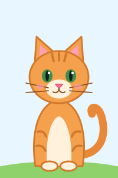

# mein-erstes-projekt

Eine kleine, eigenständige Landing-Page mit einem generativen Hintergrund:
über tausend Partikel folgen einem sich langsam verändernden Strömungsfeld,
ziehen leuchtende Spuren und weichen dem Mauszeiger (oder Finger) aus.

- Reines HTML, CSS und JavaScript – kein Build-Schritt, keine Abhängigkeiten
- Hell- und Dunkelmodus über `prefers-color-scheme`
- Respektiert `prefers-reduced-motion` (zeigt dann ein ruhiges, statisches Bild;
  die Animation lässt sich per Button trotzdem starten oder pausieren)
- Responsiv bis Handybreite, scharf auf High-DPI-Displays

## Öffnen

Einfach `index.html` im Browser öffnen (Doppelklick genügt).

Optional über einen lokalen Server:

```sh
python -m http.server 8000
# dann http://localhost:8000 aufrufen
```

## Dateien

| Datei        | Inhalt                                             |
| ------------ | -------------------------------------------------- |
| `index.html` | Seitenstruktur                                      |
| `style.css`  | Layout, Typografie, Farben (hell/dunkel)            |
| `main.js`    | Canvas-Animation (Strömungsfeld, Maus-Interaktion) |
| `images/blume.svg` | Blumen-Grafik                                 |
| `katze.js`   | Balu, die Katze, die über die Seite läuft           |
| `images/katze.svg` | Porträt von Balu                              |

## Blume

Unter Titel und Untertitel zeigt die Seite eine kleine Blume
(`images/blume.svg`), die sanft hin- und herschwingt – bei
`prefers-reduced-motion` steht sie still.


## Balu, die Katze

Unten auf der Seite streift Balu umher, eine rot getigerte Katze (`katze.js`):
Sie sucht sich einen Platz, läuft mit wippenden Beinen hin, bleibt eine
Weile stehen und zieht dann weiter. Pausiert man die Animation – oder ist
`prefers-reduced-motion` aktiv –, bleibt auch Balu stehen.

Als Porträt gibt es Balu zusätzlich als `images/katze.svg`:


