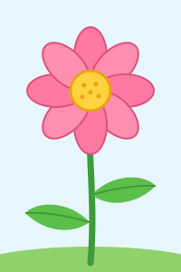

# mein-erstes-projekt

Eine kleine, eigenständige Landing-Page mit einem generativen Hintergrund:
über tausend Partikel folgen einem sich langsam verändernden Strömungsfeld,
ziehen leuchtende Spuren und weichen dem Mauszeiger (oder Finger) aus.

- Reines HTML, CSS und JavaScript – kein Build-Schritt, keine Abhängigkeiten
- Hell- und Dunkelmodus über `prefers-color-scheme`
- Respektiert `prefers-reduced-motion` (zeigt dann ein ruhiges, statisches Bild;
  die Animation lässt sich per Button trotzdem starten oder pausieren)
- Responsiv bis Handybreite, scharf auf High-DPI-Displays

## Öffnen

Einfach `index.html` im Browser öffnen (Doppelklick genügt).

Optional über einen lokalen Server:

```sh
python -m http.server 8000
# dann http://localhost:8000 aufrufen
```

## Dateien

| Datei        | Inhalt                                             |
| ------------ | -------------------------------------------------- |
| `index.html` | Seitenstruktur                                      |
| `style.css`  | Layout, Typografie, Farben (hell/dunkel)            |
| `main.js`    | Canvas-Animation (Strömungsfeld, Maus-Interaktion) |
| `images/blume.svg` | Blumen-Grafik                                 |
| `leinwand/`  | Ergebnis-Leinwand für alle Agenten-Ergebnisse      |

## Blume

Unter Titel und Untertitel zeigt die Seite eine kleine Blume
(`images/blume.svg`), die sanft hin- und herschwingt – bei
`prefers-reduced-motion` steht sie still.



## Ergebnis-Leinwand

`leinwand/index.html` ist eine riesige, verschiebbare und zoombare Leinwand,
auf der alle Ergebnisse der Agenten zu sehen sind – erreichbar auch über den
Button auf der Startseite.

- **Jede Zeile ein Agent, jede Spalte ein Ergebnis** in zeitlicher Reihenfolge.
  Oben läuft `main`: gemergte Pull Requests münden mit einer durchgezogenen
  Linie hinein, offene mit einer gestrichelten.
- **Karten** zeigen Status (gemergt, offen, nur Branch, geschlossen, ohne PR),
  Titel, Datum, geänderte Zeilen, Dateien und eine Bildvorschau, falls ein
  Bild dazugehört.
- **Klick auf eine Karte** öffnet die Details: Auftrag, Verlauf, alle Bilder,
  Beschreibung und Dateien, mit Link zu GitHub.
- **Filter und Suche** oben, **Übersichtskarte** unten rechts.
- Bedienung: ziehen zum Verschieben, Mausrad oder zwei Finger zum Zoomen,
  Tasten `+` `−` `0` und Pfeiltasten.

Die Daten kommen live von der GitHub-API (öffentliches Repo, kein Login nötig)
und werden zehn Minuten zwischengespeichert; ↻ lädt neu. Ein anderes Repo
geht mit `leinwand/index.html?repo=besitzer/name`.

### Aufträge aus dem Agent Office einblenden

```sh
node leinwand/sammeln.mjs
```

liest `.agent-office/workers.json` und `queue.json` und schreibt
`leinwand/agenten.js`. Danach zeigt die Leinwand zu jedem Ergebnis den
ursprünglichen Auftrag, Namen und Farbe des Agenten – und auch Aufträge, zu
denen es noch keinen Pull Request gibt. Die Datei bleibt lokal (`.gitignore`).

### Als Display an der Wand im Agent Office

Die Wände im Agent Office zeigen Bilder, keine Webseiten. Deshalb rendert
`leinwand/bild.mjs` die Leinwand im Wand-Modus (`?wand`, ohne Bedienelemente)
als großes PNG. Die GitHub Action **Leinwand-Bild** macht das bei jedem neuen,
geänderten oder gemergten Pull Request und legt das Bild auf den Branch
`leinwand-bild`. Im Office hängst du es so auf: Bild aufhängen → Link einfügen:

```
https://raw.githubusercontent.com/ler0xx/mein-erstes-projekt/leinwand-bild/leinwand.png
```

Das Office lädt das Bild selbst nach (es speichert es bis zu einer Stunde
zwischen). Von Hand neu erzeugen: in GitHub unter *Actions → Leinwand-Bild →
Run workflow* oder lokal mit `node leinwand/bild.mjs`. Aufträge aus dem
Agent Office kommen nicht ins Bild, weil es öffentlich ist.
