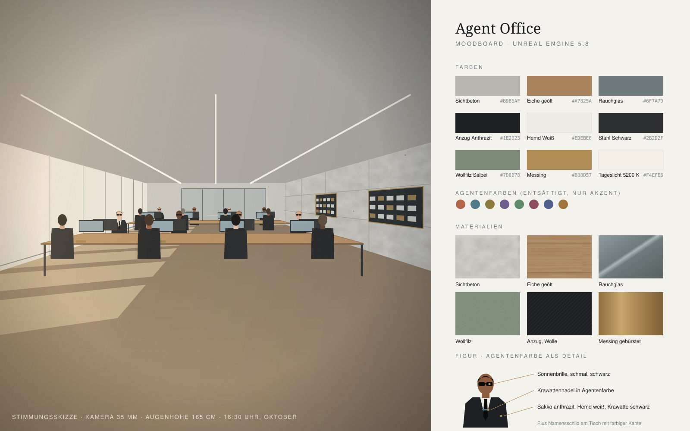

# Figuren-Spezifikation: Agenten als MetaHumans

Jeder Agent im Office ist ein MetaHuman. Die Kleidung ist bei allen gleich, die Menschen sind es nicht.

## 1. Uniform

| Teil | Vorgabe |
| --- | --- |
| Sakko + Hose | Einreiher, anthrazit bis schwarz (`#1E2023`), Wolle matt, schmale Revers, gut sitzend (nicht zu weit) |
| Hemd | weiß (`#EDEBE6`, kein reines Weiß), Kentkragen |
| Krawatte | schwarz, schmal (6–7 cm), matter Seidenglanz |
| Sonnenbrille | schmale, rechteckige Brille, schwarzer Rahmen, dunkle Gläser mit leichter Reflexion. Wird **immer** getragen, auch drinnen |
| Schuhe | schwarze Oxford-Schuhe |
| Krawattennadel | Messing, mit kleinem Emaille-Feld in der **Agentenfarbe** |

Für die Umsetzung gilt: Sakko, Hemd und Krawatte sind ein gemeinsames Kleidungs-Asset für alle Agenten.
Die Sonnenbrille ist ein eigenes Static Mesh, das an den Kopfknochen (`head`) gehängt wird. So braucht nicht jedes Gesicht eine eigene Brille.

## 2. Vielfalt der Gesichter

Mindestens **8 unterschiedliche MetaHumans** (einer pro Schreibtisch). Bei mehr Agenten werden sie wiederverwendet, aber nie zwei gleiche nebeneinander.

| # | Richtung (Beispiel) |
| --- | --- |
| 1 | Frau, Mitte 30, dunkle Haut, kurze natürliche Locken |
| 2 | Mann, Ende 40, helle Haut, graue Schläfen, kurzer Seitenscheitel |
| 3 | Frau, Ende 20, ostasiatisch, glatter Pagenkopf |
| 4 | Mann, Mitte 30, mittlere Haut, Glatze, gepflegter kurzer Bart |
| 5 | Frau, Mitte 50, helle Haut, graues Haar im Dutt |
| 6 | Mann, Ende 20, südasiatisch, zurückgekämmtes schwarzes Haar |
| 7 | Frau, Anfang 40, mittlere Haut, Zopf |
| 8 | Mann, Anfang 60, dunkle Haut, kurzes graues Haar, Schnurrbart |

Regeln: unterschiedliche Hauttöne, Altersstufen, Frisuren und Körpergrößen (165–192 cm).
Keine extremen Regler-Werte, die Figuren sollen wie echte Kolleginnen und Kollegen wirken.

## 3. Agentenfarbe: dezent, aber auffindbar

Die Farbe aus der App wird entsättigt (Sättigung ≤ ca. 45 %) und nur an drei kleinen Stellen gezeigt:

1. **Krawattennadel:** Emaille-Feld ca. 1 × 4 cm. Aus der Nähe zu erkennen.
2. **Namensschild am Tisch:** kleines Schild aus Messing oder Acryl mit dem Agentennamen,
   die **Unterkante** in der Agentenfarbe (ca. 5 mm). Aus der Übersicht zu erkennen.
3. **Kaffeebecher** auf dem Tisch in der Agentenfarbe (optional, matte Keramik).

Für die Umsetzung: ein Material-Parameter `AgentColor` (Vector) am Nadel- und Schild-Material,
der zur Laufzeit gesetzt wird. **Nicht** einfärben: Anzug, Hemd, Monitore, Licht.

## 4. Haltungen und Animationen

| Zustand | Haltung | Details |
| --- | --- | --- |
| **arbeitet** | sitzt aufrecht, leicht nach vorn geneigt, Hände auf der Tastatur, **tippt** | Kopf blickt zum Monitor, gelegentlich kurze Pause mit Blick auf zweites Fenster, alle 20–40 s minimale Gewichtsverlagerung |
| **wartet** | **lehnt sich zurück** in den Stuhl | Arme verschränkt oder Hände im Schoß, Kopf leicht geneigt, ab und zu ein Blick zur Aufgaben-Warteschlange |
| **an der Wandtafel** | steht ca. 70 cm vor der Tafel | eine Hand in der Hosentasche, die andere zeigt kurz auf eine Karte |
| **Besprechung** | sitzt am Besprechungstisch | Unterarme auf dem Tisch; das Kopfende (`meeting-1`) spricht mit kleinen Handgesten |
| **gehen** | ruhiges, gleichmäßiges Gehtempo (~1,2 m/s) | zwischen Plätzen, Wege durch die Gänge |

Übergänge zwischen den Zuständen werden **geblendet** (0,3–0,5 s), kein hartes Umschalten.
Die Animationen werden mit dem IK Retargeter auf das MetaHuman-Skelett übertragen (siehe `assets.md`).

## 5. Technik-Hinweise für die Umsetzung

- MetaHumans sind aufwendig. Für die Übersichtskamera reichen niedrigere LODs; volle Details erst in der Nahansicht.
- Haare: bei vielen Figuren gleichzeitig die günstigeren Haar-Varianten (Karten statt Strähnen) für entfernte LODs verwenden.
- Die Sonnenbrille spart Aufwand bei den Augen. Die Augen-Animation ist trotzdem an, weil man sie durch die Gläser leicht sieht.
