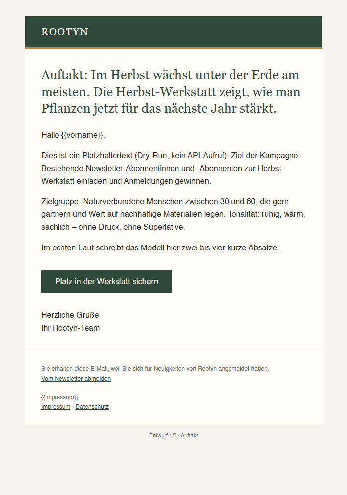

# E-Mail-Kampagnen-Agent

Ein kleines Kommandozeilen-Werkzeug, das aus einem kurzen Kampagnen-Briefing
fertige E-Mail-Entwürfe schreibt – in der ruhigen, erdigen Markenwelt von
Rootyn (Papierweiß, Waldgrün, Ocker).

**Der Agent versendet nichts.** Er erzeugt nur Dateien, die du prüfst und
danach selbst in dein Mail-Tool überträgst.



## Installation

Python 3.10 oder neuer wird benötigt.

```sh
python -m venv .venv
# Windows:      .venv\Scripts\activate
# macOS/Linux:  source .venv/bin/activate
pip install -r email-agent/requirements.txt
```

## API-Key setzen

Der Agent liest den Key **ausschließlich** aus der Umgebungsvariable
`ANTHROPIC_API_KEY`. Den Key nie in eine Datei im Repo schreiben.

```sh
# macOS/Linux
export ANTHROPIC_API_KEY="sk-ant-..."
```

```powershell
# Windows PowerShell
$env:ANTHROPIC_API_KEY = "sk-ant-..."
```

## Aufruf

```sh
# Echter Lauf mit Claude (Standardmodell: claude-sonnet-5-5)
python email-agent/agent.py email-agent/briefings/beispiel.yaml

# Testlauf ohne API-Key und ohne API-Aufruf (Platzhaltertexte)
python email-agent/agent.py email-agent/briefings/beispiel.yaml --dry-run

# Anderes Modell
python email-agent/agent.py email-agent/briefings/beispiel.yaml --model claude-opus-5-5
```

Weitere Optionen: `--out <ordner>` (Ausgabeordner) und `--no-fallback`
(standardmäßig springt serverseitig ein anderes Modell ein, falls eine Anfrage
von einem Sicherheitsfilter abgelehnt wird).

## Briefing

YAML oder JSON, siehe [`briefings/beispiel.yaml`](briefings/beispiel.yaml).

| Feld             | Pflicht | Bedeutung                                         |
| ---------------- | ------- | ------------------------------------------------- |
| `kampagnenname`  | ja      | Name, bestimmt auch den Ausgabeordner             |
| `ziel`           | ja      | Was die Kampagne erreichen soll                   |
| `zielgruppe`     | ja      | Für wen die Mails sind                            |
| `kernbotschaft`  | ja      | Der eine Gedanke, der hängen bleiben soll         |
| `call_to_action` | ja      | Text für den Button                               |
| `link`           | ja      | Ziel des Buttons                                  |
| `tonalitaet`     | nein    | Standard: „ruhig, klar, freundlich“               |
| `anzahl_mails`   | nein    | Länge der Sequenz, 1–10, Standard: 3              |
| `sprache`        | nein    | Standard: Deutsch                                 |

## Ausgabe

Alles landet in `email-agent/out/<kampagnenname>/` (per `.gitignore` vom
Repo ausgeschlossen):

- `mail-01.html`, `mail-02.html`, … – mailtaugliches Layout (Tabellen,
  Inline-CSS, max. 600 px breit, versteckter Preheader)
- `mail-01.txt`, … – Plain-Text-Version derselben Mail
- `summary.md` – je Mail drei Betreffzeilen-Varianten für A/B-Tests, der
  Preheader und ein Versandplan mit empfohlenem Zeitpunkt und Abstand

## DSGVO, Abmeldelink und Impressum

Jede Vorlage enthält feste Platzhalter, die dein Versand-Tool beim Versand
befüllen muss:

| Platzhalter            | Inhalt                                      |
| ---------------------- | ------------------------------------------- |
| `{{unsubscribe_link}}` | Persönlicher Abmeldelink (Pflicht)          |
| `{{impressum}}`        | Anbieterkennzeichnung (Name, Anschrift …)   |
| `{{impressum_link}}`   | Link zum Impressum                          |
| `{{datenschutz_link}}` | Link zur Datenschutzerklärung               |
| `{{vorname}}`          | Persönliche Anrede                          |

Bitte beachten:

- Werbe-Mails nur an Empfänger, die nachweislich eingewilligt haben
  (Double-Opt-in).
- Der Abmeldelink muss in jeder Mail funktionieren – nicht entfernen.
- Das Briefing wird zur Texterstellung an die Anthropic-API geschickt. Keine
  personenbezogenen Daten (Empfängerlisten, E-Mail-Adressen) ins Briefing
  schreiben.
- Die Texte sind Entwürfe: vor dem Versand inhaltlich und rechtlich prüfen.

## Mögliche nächste Ausbaustufen

- Export für Versanddienste wie Brevo oder Mailchimp (Platzhalter in deren
  Merge-Tags umwandeln, z. B. `{{unsubscribe_link}}` → `*|UNSUB|*` bei
  Mailchimp, und Vorlagen per API als Entwurf anlegen – weiterhin ohne
  automatischen Versand)
- Vorschau aller Mails einer Sequenz auf einer Seite
- Dunkelmodus-Varianten der HTML-Vorlage
