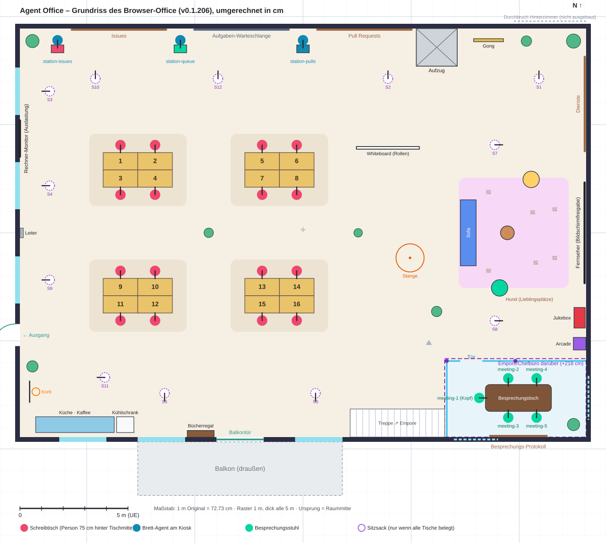

# Grundriss des Browser-Office (Original) für Unreal

Ziel: Das UE5-Office soll **genau so aufgebaut** sein wie das bisherige Browser-Office
(AgentSystemLabs/agent-office, MIT-Lizenz, **Version 0.1.206**), nur fotorealistisch.
Hier steht, wo der Grundriss im Original definiert ist, wie er umgerechnet wurde und was
am Level-Skript noch angepasst werden muss.



Die Draufsicht (`grundriss-original.svg`), `Content/Data/DeskLayout.json` und
`Content/Data/OfficeRoom.json` werden von **`Scripts/grundriss_original.py`** erzeugt
(normales Python 3, kein Unreal nötig). Ändert sich etwas am Original, dort die Zahlen
anpassen und neu ausführen:

```bat
cd unreal\AgentOffice
python Scripts\grundriss_original.py
```

---

## 1. Wo der Grundriss im Original steht

Das Original wurde nur gelesen, nicht verändert. Der GitHub-Tag `v0.1.206` und die
installierte Version (`C:/Users/info/AppData/Local/agent-office/versions/v0.1.206/`) haben
dieselben Werte (abgeglichen).

| Was | Quelle (GitHub `src/…`, installiert `dist/…`) |
|---|---|
| Raum, Schreibtische, Sitzsäcke, Brett-Agenten, Besprechungsraum, Bretter, Fenster, Türen, Deko-Positionen | `src/shared/layout.ts` bzw. `dist/server/shared/layout.js`: `FLOOR`, `WALL_HEIGHT`, `DESK_SIZE`, `buildDesks()` → `DESKS`, `WING`/`WING_DESKS`, `BEANBAGS`, `STATIONS`, `KIOSK`, `LOFT`, `STAIRS`, `MEETING_ROOM`, `MEETING_TABLE`, `MEETING_SEATS`, `BOARDS`, `MEETING_BOARD`, `TV`, `MACHINE_MONITOR`, `JUKEBOX`, `CABINET`, `BOOKSHELF`, `GONG`, `PLANTS`, `WHITEBOARD`, `WINDOWS`, `EXIT_DOOR`, `BALCONY_DOOR`, `BALCONY`, `ELEVATOR`, `LADDER`, `POLES`, `SPAWN`, `SEATING` |
| Wie das Office zusammengebaut wird | `src/client/world/office/build.ts` → `buildOffice()` / `floorPlan()` |
| Wo die Person am Tisch / am Kiosk ist | `src/client/world/office/seats.ts` → `buildDesk()` (Person 0,93 m hinter Tischmitte), `buildKiosk()` (Agent `KIOSK.stand` = 0,55 m hinter dem Kiosk) |
| Besprechungsraum (Glaswände, Tür, Stühle) | `src/client/world/office/meeting-room.ts` → `buildMeetingRoom()` (Stuhl 0,85 m hinter dem Platz am Tisch) |
| Teppiche, Lounge (Sofa, Couchtisch, Poufs), Pendelleuchten, Bretter, Fernseher | `src/client/world/office/room.ts` |
| Außenwände, Fenster, Türen | `src/client/world/office/shell.ts` → `buildWalls()`, `windowIn()`; `materials.ts` → `onWall()` |
| Empore / Chefbüro | `src/client/world/office/loft.ts` |
| Küche (Theke, Espressomaschine, Kühlschrank) | `src/client/world/kitchen.ts` |
| Basketballkorb | `src/shared/hoop.ts` → `HOOP` |
| Hund | `src/server/dog.ts` → `LOUNGE` (Lieblingsplätze; sonst läuft er herum, schläft unter Tischen) |

Stand dieses Büros (aus `.agent-office/`, nur die nötigen Felder gelesen):
`floorplan.json` → `wing = 0` (das **Hinterzimmer ist nicht ausgebaut**), `decor.json` ist leer
(**keine Wandbilder**), kein `maps/`-Ordner (es gilt die Standardkarte „office“).
Über `desk-1` hängt ein Tischschild (Text steht in `floorplan.json`, hier nicht übernommen).

## 2. Koordinatensystem des Originals

- Einheit **Meter**, three.js, **y = oben**.
- Draufsicht: **+x = Osten**, **+z = Süden** (zur Straße). Der Boden reicht von
  x = −18 … 18 und z = −13 (Nordwand) … 13 (Südwand) → **36 × 26 m**, Decke 6,8 m, Wände 0,3 m.
- `rotY` dreht ein Objekt so, dass seine Vorderseite nach (sin rotY, cos rotY) zeigt
  (Bretter: „0 = +z“). **Personen** an Plätzen sitzen auf dieser Seite und **schauen
  entgegengesetzt**, also nach (−sin rotY, −cos rotY) – auf ihren Tisch.

## 3. Umrechnung in unser Format

| | Original | Unser Format |
|---|---|---|
| Einheit | m | cm |
| Maßstab | Schreibtisch 2,2 × 1,1 m | 160 × 80 cm → **1 m = 72,73 cm** (= 80/1,1) |
| Ursprung | Raummitte | Raummitte (gleich) |
| Achsen | x Ost, z Süd | `x = x·72,73`, `y = z·72,73` (keine Spiegelung) |
| Blickrichtung der Person | (−sin rotY, −cos rotY) | `yaw = atan2(−cos rotY, −sin rotY)` → 0° = +x, 90° = +y |
| Vorderseite eines Objekts | (sin rotY, cos rotY) | `yaw = atan2(cos rotY, sin rotY)` |

Bedeutung von x/y je Platztyp (so, wie der `OfficeDirector` die Figur setzt):

- **`desk`** – Tischmitte, exakt wie im Original. Im Original sitzt die Person 0,93 m
  (= 68 cm) hinter der Tischmitte, bei uns 75 cm (`DeskSeatOffset`) – 7 cm weiter hinten, passt.
- **`station`** (Brett-Agent) – **Abweichung von „Tafelmitte“:** Im Original steht der Agent
  **mit dem Rücken zur Nordwand hinter einem kleinen Kiosk und schaut in den Raum**; die
  6 m breite Tafel hängt nicht vor ihm, sondern 3,9 m östlich daneben. Der `OfficeDirector`
  stellt die Person 70 cm *entgegen* der Blickrichtung hinter x/y. Damit sie genau dort steht
  wie im Original (54 cm vor der Wand, Blick nach Süden, yaw 90), ist x/y bei Stationen der
  **Punkt 70 cm vor dem Agenten** (liegt am Kiosk). Tafeln und Kioske stehen deshalb
  getrennt in `OfficeRoom.json` (`wandtafeln`, `kioske`).
- **`meeting`** – Stuhlmitte = Person. Original: Platz am Tisch (Laptop) + 0,85 m nach hinten.
  `meeting-1` ist der **„Kopf des Tisches“** (Westende, Blick nach Osten).
- **`beanbag`** (neu) – Sitzsack, x/y = Person. Im Original kommen Sitzsäcke nur heraus, wenn
  **alle Schreibtische belegt** sind (`beanbagsOut()`), einer nach dem anderen in dieser Reihenfolge.
  Der `OfficeDirector` setzt die Figur bei unbekanntem Typ ohne Versatz genau auf x/y – es
  braucht dafür keine Code-Änderung; `build_level.py` baut für diesen Typ (noch) nichts.

## 4. Raummaße

| | Original | UE (cm) |
|---|---|---|
| Innenmaß | 36 × 26 m | **2618 × 1891** (x −1309 … 1309, y −945 … 945) |
| Wandstärke | 0,3 m | 22 |
| Deckenhöhe | 6,8 m (Empore im Raum) | 495 umgerechnet – Empfehlung siehe [Höhen](#9-höhen) |

## 5. Plätze (`Content/Data/DeskLayout.json`)

36 Plätze. Gegenüber vorher: `desk-9` … `desk-16`, `station-issues`, `meeting-5` und
`beanbag-1` … `beanbag-12` neu; alle alten IDs bleiben, haben aber neue Koordinaten.

**Schreibtische** – vier Inseln à 2 × 2 Tische Rücken an Rücken (Inseln bei x −764 / −109,
y −291 / +291). Die nördliche Reihe einer Insel schaut nach Süden (yaw 90), die südliche nach Norden (yaw 270).

| Insel | Tisch (x, y, yaw) |
|---|---|
| Nordwest | desk-1 (−844, −331, 90) · desk-2 (−684, −331, 90) · desk-3 (−844, −251, 270) · desk-4 (−684, −251, 270) |
| Nordost | desk-5 (−189, −331, 90) · desk-6 (−29, −331, 90) · desk-7 (−189, −251, 270) · desk-8 (−29, −251, 270) |
| Südwest | desk-9 (−844, 251, 90) · desk-10 (−684, 251, 90) · desk-11 (−844, 331, 270) · desk-12 (−684, 331, 270) |
| Südost | desk-13 (−189, 251, 90) · desk-14 (−29, 251, 90) · desk-15 (−189, 331, 270) · desk-16 (−29, 331, 270) |

**Brett-Agenten** (Nordwand, Blick in den Raum, yaw 90):

| deskId | Label | x/y (Bezugspunkt) | Person | Kiosk (Mitte, 58 × 36 cm) | zugehörige Tafel |
|---|---|---|---|---|---|
| station-issues | Issues-Brett | −1135, −821 | −1135, −891 | −1135, −851 (rot) | Issues, Mitte x −851 |
| station-queue | Aufgaben-Warteschlange | −567, −821 | −567, −891 | −567, −851 (grün) | Aufgaben-Warteschlange, Mitte x −284 |
| station-pulls | PR-Brett | 0, −821 | 0, −891 | 0, −851 (blau) | Pull Requests, Mitte x 284 |

**Besprechungstisch** (Tisch Mitte 996/764, 305 × 124 cm):

| deskId | Label | x, y | yaw |
|---|---|---|---|
| meeting-1 | Kopf des Tisches | 815, 764 | 0 |
| meeting-2 | Besprechungsstuhl 2 | 949, 673 | 90 |
| meeting-3 | Besprechungsstuhl 3 | 949, 855 | 270 |
| meeting-4 | Besprechungsstuhl 4 | 1080, 673 | 90 |
| meeting-5 | Besprechungsstuhl 5 | 1080, 855 | 270 |

**Sitzsäcke** (Reihenfolge = Reihenfolge, in der sie herauskommen; jeder schaut zu einem Fenster oder einer Wand, mit Lap-Desk davor):
beanbag-1 (1091, −713, 270) · 2 (393, −713, 270) · 3 (−1171, −655, 180) · 4 (−1171, −218, 180) ·
5 (−640, 742, 90) · 6 (58, 742, 90) · 7 (887, −407, 0) · 8 (887, 407, 0) · 9 (−1171, 218, 180) ·
10 (−960, −713, 270) · 11 (−916, 669, 180) · 12 (−393, −713, 270).

**Nicht übernommen – Hinterzimmer** (`WING_DESKS`, existieren erst, wenn das Büro nach Norden
ausgebaut wird; hier `wing = 0`): desk-17 (1142, −1153, 90), desk-18 (1142, −1073, 270),
desk-19 (1142, −1487, 90), desk-20 (1142, −1407, 270). Stehen in `OfficeRoom.json` unter
`hinterzimmer_plaetze`.

## 6. Wände, Fenster, Türen

Alle Koordinaten auf der Wand-Innenseite. Höhen umgerechnet (siehe [Höhen](#9-höhen)).

| Wand | Was | von → bis (x, y) | Unter-/Oberkante |
|---|---|---|---|
| Nord | durchgehend; Aufzug, Bretter, Gong davor | (−1309, −945) → (1309, −945) | – |
| Nord | Durchbruch Hinterzimmer (nur bei Ausbau) | x 975 … 1309 | – |
| Süd | Fenster 1 | (−1127, 945) → (−909, 945) | 80 / 240 |
| Süd | Fenster 2 | (−764, 945) → (−545, 945) | 80 / 240 |
| Süd | **Glasschiebetür zum Balkon** | (−400, 945) → (−182, 945) | 0 / 182 |
| Süd | Fenster 3 | (−36, 945) → (182, 945) | 80 / 240 |
| Süd | Fenster der Empore (hoch) | (698, 945) → (902, 945) | 284 / 400 |
| West | Fenster 1 | (−1309, −764) → (−1309, −545) | 80 / 240 |
| West | Fenster 2 | (−1309, −327) → (−1309, −109) | 80 / 240 |
| West | Fenster 3 | (−1309, 109) → (−1309, 327) | 80 / 240 |
| West | **Ausgang** (Tür nach außen, Treppe zur Straße) | (−1309, 422) → (−1309, 524) | 0 / 175 |
| Ost | geschlossen; Fenster nur in der Empore | (1309, 662) → (1309, 865) | 284 / 400 |

Innenwände: **Besprechungsraum** aus Glas – Nordseite y 593 von x 665 bis 1309 mit
**Schiebetür x 727 … 829**, Westseite x 665 von y 593 bis 945; Höhe bis unter die Empore.
**Aufzugsschacht** x 524 … 713, y −945 … −771, Türen (102 cm) nach Süden.

## 7. Bretter, Bildschirme, Wandobjekte

`z` = Höhe der Mitte, `yaw` = Richtung, in die die Vorderseite schaut.

| Objekt | x, y | z | Größe (B × H) | yaw | Hinweis |
|---|---|---|---|---|---|
| Tafel „Issues“ | −851, −940 | 153 | 436 × 218 | 90 | Holzrahmen, Kork |
| Tafel „Aufgaben-Warteschlange“ | −284, −940 | 153 | 436 × 218 | 90 | Whiteboard, Aluminiumrahmen |
| Tafel „Pull Requests“ | 284, −940 | 153 | 436 × 218 | 90 | Holzrahmen |
| Tafel „Dienste“ | 1303, −596 | 153 | 436 × 218 | 180 | Ostwand |
| Tafel Besprechungs-Protokoll | 996, 940 | 142 | 262 × 87 | 270 | Südwand im Besprechungsraum |
| Fernseher (Bildschirmfreigabe) | 1302, 0 | 160 | 465 × 262 | 180 | Ostwand, Lounge |
| Rechner-Monitor (Auslastung) | −1309, −436 | 160 | 167 × 95 | 0 | Westwand zwischen Fenster 1 und 2 |
| Gong | 858, −891 | – | 138 breit, 178 hoch | 90 | an der Nordwand östlich vom Aufzug |
| Leiter (Luke in Decke/Boden) | −1264, 0 | – | 45 breit | 0 | Westwand zwischen Fenster 2 und 3 |
| Basketballkorb | Brett −1264, 735; Ring −1235, 735 | Ring 222 | Brett 102 breit | 0 | Westwand zwischen Ausgang und Küche |

## 8. Möbel und Deko

| Objekt | x, y | Größe | yaw | Hinweis |
|---|---|---|---|---|
| Lounge-Sofa (blau) | 764, 0 | 305 × 73 | 0 | Rücken zum Raum, Blick zum Fernseher |
| Couchtisch (rund) | 945, 0 | Ø 65 | – | |
| Pouf grün / gelb | 909, 255 / 1055, −247 | Ø 76 | zum Fernseher | |
| Lounge-Teppich (rosa) | x 720 … 1229, y −255 … 255 | | | |
| Teppiche unter den Tischinseln | je 451 × 335 um (−764/−109, ±291) | | | |
| Jukebox | 1279, 393 | 95 × 52 | 180 | Ostwand |
| Arcade-Automat | 1279, 513 | 58 × 58 | 180 | Ostwand |
| Bücherregal (Projekt-Doku) | −473, 930 | 124 × 31 | 270 | Südwand zwischen Fenster 2 und Balkontür |
| Whiteboard auf Rollen | 393, −393 | 291 breit | 90 | frei im Raum |
| Feuerwehrstange mit Geländer | 495, 116 | Geländer r = 65 | – | im untersten Stock eine Matte statt Loch |
| Küchenzeile mit Spüle | x −1236 … −873, y 851 … 924 | | 270 | Südwand; Espressomaschine bei x −1142 |
| Retro-Kühlschrank | x −862 … −782, y 851 … 924 | | 270 | |
| Topfpflanzen | (−1251, −887) · (1251, −887) · (1251, 887) · (−1251, 618) · (1033, −887) · (−436, 0) · (255, 0) · (618, 364) | Größe 1,4 · 1,5 · 1,3 · 1,2 · 1,1 · 1,0 · 0,9 · 1,1 | | abwechselnd Monstera, Bogenhanf, Ficus; Topf-Ø ≈ 44 cm × Größe |
| Pendelleuchten | über jeder Tischinsel (−764/−109, ±291) und über dem Couchtisch (945, 0) | | | |
| Hund | Lieblingsplätze (1164, 116) · (1164, −109) · (1076, 138) · (858, 175) · (858, −189) · (1062, −95) | | | liegt auf dem Lounge-Teppich, läuft sonst herum, schläft unter Tischen arbeitender Agenten |
| Startpunkt des Spielers | 582, 509 | | | |

**Bereiche:**

| Bereich | x | y | Hinweis |
|---|---|---|---|
| Besprechungsraum | 665 … 1309 | 593 … 945 | Glaswände Nord/West, darüber die Empore |
| Empore (Chefbüro) | 655 … 1309 | 582 … 945 | Stützen bei (665, 593) und (982, 593); Glas nach Nord/West; Chefschreibtisch, Sofa, Teleskop |
| Treppe zur Empore | 218 … 655 | 815 … 945 | 15 Stufen entlang der Südwand, steigt nach Osten |
| Balkon (draußen) | −764 … 182 | 967 … 1215 | Bank, Bistrotisch mit 2 Hockern, Aschenbecher, Golf-Abschlag |

## 9. Höhen

In `OfficeRoom.json` sind Höhen wie die Grundfläche mit 0,727 umgerechnet. Für Fenster,
Tafeln und Bildschirme passt das gut (Fenster 80–240 cm). Möbel, Türen und die Empore
würden dabei aber zu niedrig. Empfohlen:

| | umgerechnet | **Empfehlung** |
|---|---|---|
| Decke | 495 | **560** (damit Empore und Besprechungsraum darunter passen) |
| Empore: Oberkante Boden / lichte Höhe darunter | 218 / 200 | **280 / 255** (Deckenplatte 25) |
| Empore-Fenster (Süd, Ost) | 284–400 | **345–460** (gleicher Abstand zum Emporenboden) |
| Ausgang / Balkontür | 175 / 182 | **220 / 230** |
| Schreibtisch / Besprechungstisch | 57 / 55 | **75 / 75** |
| Kiosk der Brett-Agenten | 40 | **105** (Stehpult) |
| Küchentheke / Kühlschrank | 75 / 160 | **90 / 170** |

## 10. Nötige Anpassungen am Level-Skript

`Scripts/build_level.py` und der C++-Code wurden **nicht** geändert. Damit das Level dem
Original entspricht, braucht `build_level.py` Folgendes (alle Werte stehen maschinenlesbar in
`Content/Data/OfficeRoom.json`, am besten dort einlesen statt abtippen):

1. **Raumgröße:** `ROOM_W = 2618`, `ROOM_D = 1891`, `ROOM_H = 560` (siehe Höhen), `WALL_T = 22`.
2. **Wände und Öffnungen:** Statt Fensterfronten im Westen und Süden und Eingang in der Nordwand:
   - Nordwand **geschlossen** (kein Eingang bei x 160 … 260); davor der Aufzugsschacht.
   - Südwand mit **3 Einzelfenstern**, der **Glasschiebetür zum Balkon** und dem hohen Emporenfenster.
   - Westwand mit **3 Einzelfenstern** und der **Ausgangstür** (y 422 … 524).
   - Ostwand **geschlossen** bis auf das hohe Emporenfenster.
   - Fenster einzeln aus `fenster[]` bauen (Brüstung 80, Sturz 240) statt `window_front()` mit Pfosten über die ganze Länge.
3. **Besprechungsraum:** `GLASS_X`/`GLASS_Y`/`GLASS_DOOR` ersetzen: Glas von (665, 593) nach
   Osten bis zur Ostwand und nach Süden bis zur Südwand; **Tür in der Nordseite** bei
   x 727 … 829 (nicht in der Westseite).
4. **Empore** über dem Besprechungsraum (x 655 … 1309, y 582 … 945, Boden 280) mit zwei
   Stützen und Treppe entlang der Südwand (x 218 … 655).
5. **Besprechungstisch** direkt aus `besprechungstisch` bauen (Mitte 996/764, 305 × 124);
   aus den Stühlen berechnet käme 260 × 92 heraus.
6. **Stationen:** An `station`-Plätzen **keine Tafel** bauen (x/y ist nicht die Tafelmitte,
   siehe Abschnitt 3), sondern einen **Kiosk** aus `kioske[]`. Die vier großen Tafeln
   (Issues, Aufgaben-Warteschlange, Pull Requests, Dienste) und die Protokoll-Tafel im
   Besprechungsraum aus `wandtafeln[]` an die Wand hängen.
7. **Bildschirme:** Fernseher (Ostwand) und Rechner-Monitor (Westwand) aus `bildschirme[]`.
8. **Deko und Möbel** aus `objekte[]` und `bereiche[]`: Lounge (Sofa, Couchtisch, 2 Poufs,
   Teppich), Jukebox, Arcade, Bücherregal, Gong, Whiteboard auf Rollen, Feuerwehrstange,
   Leiter, Basketballkorb, Küchenzeile mit Kühlschrank, 8 Pflanzen, Teppiche unter den
   Tischinseln, Aufzug, Balkon draußen.
9. **Licht:** Die drei Linienleuchten (x −250, y −170/0/170) passen nicht mehr zu den Inseln.
   Im Original hängen **Pendelleuchten** über jeder Insel (−764/−109, ±291) und über dem
   Couchtisch (945, 0). Die Fenster liegen im Süden und Westen – die Nachmittagssonne aus
   Westen passt weiterhin.
10. **Sitzsäcke** (`type: "beanbag"`): Sitzsack mit Lap-Desk (ca. 90 × 90 cm, Lap-Desk 58 cm
    vor der Person in Blickrichtung) bauen – oder weglassen, solange nicht alle 16 Tische belegt sind.
11. **Lobby des `OfficeDirector`:** Die Standard-`LobbyLocation` (−680, 400) liegt jetzt genau
    auf dem Stuhl von desk-12. Beim Spawnen im Skript z. B. `lobby_location = (618, −690, 0)`
    und `lobby_yaw = 90` setzen (vor dem Aufzug, Blick in den Raum) – dort kommen im
    Original auch die Leute an.
12. **Übersichtskamera und Startpunkt** auf den größeren Raum anpassen. Die Südostecke liegt
    jetzt im Besprechungsraum unter der Empore; besser hoch über der Küche in der Südwestecke,
    etwa (−1200, 800, 450), mit Blick nach Nordost. Als Startpunkt eignet sich der des
    Originals (582, 509).

## 11. Prüfung

`python Scripts/grundriss_original.py` prüft bei jedem Lauf:

- `DeskLayout.json` und `OfficeRoom.json` sind gültiges JSON, keine doppelten `deskId`s.
- Keine überlappenden Schreibtische (Rücken an Rücken stehende Tische berühren sich nur).
- Keine zwei Figuren näher als 60 cm, keine Figur im Tisch oder Kiosk, alle im Raum.
- Jede `deskId` aus `.agent-office/workers.json` hat einen Platz (es wird nur das Feld
  `deskId` gelesen). Zuletzt: `desk-1` … `desk-7`, `station-pulls`, `station-queue` – alle vorhanden.

Ergebnis: **36 Plätze, 0 Probleme.**

Ein Screenshot des laufenden Browser-Office ist nicht im Repo (dort sind Agenten-Namen und
Aufgaben zu sehen). Zum Vergleich das Browser-Office öffnen und von oben auf das Büro
schauen: Norden (Bretter, Aufzug) ist oben, die Lounge mit dem Fernseher rechts, der
Besprechungsraum unten rechts – wie in der Draufsicht.
