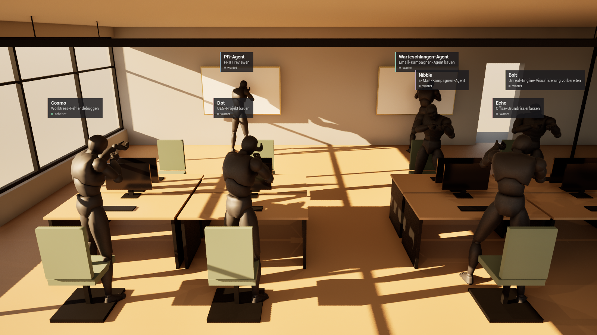

# Agent Office in Unreal Engine 5.8

Eine eigene Unreal-Anwendung, die das **Agent Office** fotorealistisch zeigt:
Die KI-Agenten sitzen als Menschen an ihren Schreibtischen, das Büro wird von
echtem Sonnenlicht durch die Fenster beleuchtet.

Die Anwendung **liest nur** den Live-Zustand des Agent Office (die Datei
`workers.json`) und stellt ihn dar. Die bestehende Browser-Ansicht des Office
wird dabei nicht verändert.

> **Stand:** Technisches Grundgerüst mit Graubox-Level. Die Figuren sind vorerst
> das Engine-Mannequin (dunkel eingefärbt), die Möbel einfache Quader. Echte
> Möbel und MetaHumans (dunkler Anzug, Sonnenbrille) folgen.
>
> Erster kompletter Test (Editor gebaut, Level erzeugt, Agenten live aus `workers.json`):
>
> 

---

## Was ist schon drin?

| Teil | Datei(en) | Aufgabe |
|---|---|---|
| Render-Einstellungen | `Config/DefaultEngine.ini` | Lumen (GI + Reflexionen, Hardware-Raytracing wenn möglich), Nanite, Virtual Shadow Maps, TSR, DirectX 12 / SM6 |
| Datenschicht | `Source/AgentOffice/OfficeStateSubsystem.*` | liest alle 2 s `workers.json`, meldet „Mitarbeiter kommt / geht / ändert sich“ |
| Grundriss | `Content/Data/DeskLayout.json` | wo welcher Platz steht (Schreibtische, Stationen, Besprechungstisch) |
| Regie | `Source/AgentOffice/OfficeDirector.*` | setzt für jeden Mitarbeiter eine Figur an seinen Platz |
| Figur | `Source/AgentOffice/AgentCharacter.*` | Person mit Namensschild, Bildschirmlicht und Status „arbeitet“ / „wartet“ |
| Testlevel | `Scripts/build_level.py` | baut `/Game/Maps/Office` (Raum, Fenster, Tische, Licht, Belichtung) |
| Screenshot | `Scripts/take_screenshot.py` | macht im laufenden Spiel automatisch ein Bild inkl. Namensschildern |

---

## Voraussetzungen

1. **Unreal Engine 5.8** (Epic Games Launcher), z. B. unter `C:/Program Files/Epic Games/UE_5.8`.
2. **Visual Studio 2022** oder die **Build Tools 2022** mit:
   - „Desktopentwicklung mit C++“ (MSVC v143)
   - **Windows SDK 10.0.22621** (ältere wie 10.0.19041 sind *nicht* nötig)
   - **.NET Framework 4.6.2 Targeting Pack** bzw. **.NET Framework 4.8 SDK**
     (in UE 5.8 die Komponente `Microsoft.Net.Component.4.6.2.TargetingPack`).
     Ohne sie bricht der Editor-Build mit
     `Could not find NetFxSDK install dir` ab.
     Nachinstallieren: *Visual Studio Installer → Ändern → Einzelne Komponenten →
     „.NET Framework 4.6.2-Zielpaket“ und „.NET Framework 4.8 SDK“*.

---

## Bauen

In einer Eingabeaufforderung im Ordner `unreal/AgentOffice`:

```bat
"C:/Program Files/Epic Games/UE_5.8/Engine/Build/BatchFiles/Build.bat" AgentOfficeEditor Win64 Development -Project="%CD%/AgentOffice.uproject" -WaitMutex
```

Alternativ: Rechtsklick auf `AgentOffice.uproject` → *Generate Visual Studio project files*,
dann in Visual Studio bauen. Oder einfach `AgentOffice.uproject` doppelklicken –
Unreal fragt dann, ob es die fehlenden Module bauen soll.

## Testlevel erzeugen

Das Level (`Content/Maps/Office.umap`) und seine Graubox-Materialien
(`Content/Graybox/`) sind eingecheckt. Sie werden **per Skript erzeugt** –
nach einer Änderung am Grundriss oder am Skript neu erzeugen und mit committen:

```bat
"C:/Program Files/Epic Games/UE_5.8/Engine/Binaries/Win64/UnrealEditor-Cmd.exe" "%CD%/AgentOffice.uproject" -run=pythonscript -script="%CD%/Scripts/build_level.py"
```

Das Skript ist wiederholbar – nach einer Änderung am Grundriss einfach erneut
ausführen. Raum und Licht folgen dem Designkonzept (`docs/agent-office-ue5/konzept.md`).
Es legt an:

- offener Raum 16 × 11 m, 3,10 m hoch: Eichenboden, Sichtbeton im Norden (mit Eingang)
  und Osten, Stahlfensterfronten im Westen und Süden (Öffnungen, Glas folgt)
- Stahlprofile des gläsernen Besprechungsraums im Osten
- Schreibtische mit Monitor, Tastatur und Stuhl an allen `desk`-Plätzen
- Tafeln mit Messingrahmen an den Stationen, Besprechungstisch aus den `meeting`-Plätzen
- tiefe Nachmittagssonne aus Westen (40 000 lx, 5 200 K), Himmelslicht, Atmosphäre,
  Wolken, ein Hauch volumetrischer Dunst
- drei gedimmte Linienleuchten über den Tischinseln (je 2 500 lm, 4 000 K)
- Post-Process mit träger Belichtung (EV100 8,5–10,5) und zurückhaltenden Linseneffekten
- den `OfficeDirector` in der Raummitte, einen Startpunkt und eine Übersichtskamera
  (Südost-Ecke, Blick nach Nordwest)

## Starten

- **Im Editor:** `AgentOffice.uproject` öffnen → *Play* (Alt+P).
- **Als eigenes Fenster:**
  ```bat
  "C:/Program Files/Epic Games/UE_5.8/Engine/Binaries/Win64/UnrealEditor.exe" "%CD%/AgentOffice.uproject" -game
  ```

Mit **W A S D** + Maus fliegt man durch das Büro.

Beim allerersten Start kompiliert Unreal die Shader – das dauert ein bis zwei
Minuten, danach geht es schnell.

### Screenshot ohne Fenster

```bat
"C:/Program Files/Epic Games/UE_5.8/Engine/Binaries/Win64/UnrealEditor.exe" "%CD%/AgentOffice.uproject" /Game/Maps/Office -game -RenderOffscreen -ResX=1600 -ResY=900 -log -ExecCmds="DisableAllScreenMessages, py %CD%/Scripts/take_screenshot.py"
```

Das Spiel startet unsichtbar, macht nach 45 s ein Bild (mit Namensschildern) und
beendet sich. Das Bild liegt danach in `Saved/Screenshots/WindowsEditor/`.

---

## Office-Ordner einstellen

Die App liest `<Office-Ordner>/workers.json`. Standard:

```
C:/Users/info/agent-office/ler0xx/mein-erstes-projekt/.agent-office
```

Ändern – entweder dauerhaft in `Config/DefaultGame.ini`:

```ini
[/Script/AgentOffice.OfficeStateSubsystem]
OfficeDir=D:/anderer/pfad/.agent-office
PollIntervalSeconds=2.0
```

… oder beim Start (hat Vorrang):

```bat
UnrealEditor.exe "%CD%/AgentOffice.uproject" -game -OfficeDir="D:/anderer/pfad/.agent-office"
```

Im Log (`Saved/Logs/AgentOffice.log`) steht, welche Datei gelesen wird und
welche Mitarbeiter kommen und gehen.

### Welche Daten werden gelesen?

Pro Mitarbeiter **nur**: `id`, `name`, `deskId`, `color`, `activity`,
`midTurn` (arbeitet gerade) und `task.name`.
Alle anderen Felder – insbesondere `hookToken`, `prompt`, `sessionId`,
`tracker` – werden übersprungen und **nie** gespeichert, angezeigt oder geloggt.
Die App schreibt nichts in den Office-Ordner.

Fehlt die Datei oder ist sie gerade halb geschrieben, bleibt der letzte gültige
Stand stehen. Fehlt sie dreimal hintereinander, gilt das Büro als leer.

---

## Grundriss (`Content/Data/DeskLayout.json`)

```json
[
  {"deskId": "desk-1", "label": "Schreibtisch 1", "type": "desk", "x": -562, "y": -42, "yaw": 90},
  ...
]
```

Es gilt dieselbe Konvention wie im Designkonzept (`docs/agent-office-ue5/konzept.md`):

| Feld | Bedeutung |
|---|---|
| `deskId` | muss zur `deskId` in `workers.json` passen (`desk-1` … `desk-8`, `station-pulls`, `station-queue`, `meeting-1` … `meeting-4`) |
| `label` | lesbarer Name |
| `type` | `desk` (Schreibtisch), `station` (Wandtafel) oder `meeting` (Platz am Besprechungstisch) |
| `x`, `y` | Zentimeter, Ursprung = **Raummitte** (dort steht der `OfficeDirector`), +X = Osten, +Y = Süden |
| `yaw` | **Blickrichtung der Person** in Grad: 0 = +X, 90 = +Y, 180 = −X, 270 = −Y |

Was `x`/`y` genau meint, hängt vom Typ ab:

- `desk`: Mitte der Tischplatte – die Person sitzt **75 cm** entgegen der Blickrichtung
- `station`: Mitte der Wandtafel – die Person steht **70 cm** davor
- `meeting`: Mitte des Stuhls (= Platz der Person); `meeting-1` ist das Kopfende.
  Der Besprechungstisch wird aus den `meeting`-Plätzen berechnet.

Die Abstände 75/70 cm lassen sich am `OfficeDirector` ändern (`DeskSeatOffset`,
`StationStandOffset`). Mitarbeiter mit einer unbekannten `deskId` warten in einer
„Lobby“ bei der Lounge im Südwesten.

Die Koordinaten stammen aus Pixels Entwurf (`docs/agent-office-ue5/DeskLayout.json`,
Branch `office/pixel-ue5`) und gelten als **vorläufig**. Ändert sich der Grundriss:
Datei hierher kopieren, `build_level.py` erneut ausführen, fertig.

---

## Figuren austauschen (MetaHumans)

Die Figur ist austauschbar, ohne Code zu ändern:

- **Nur das Mesh tauschen** – in `Config/DefaultGame.ini`:
  ```ini
  [/Script/AgentOffice.OfficeDirector]
  AgentMeshOverride=/Game/MetaHumans/Agent/Body/MeinMesh.MeinMesh
  ```
- **Ganze Figur als Blueprint** – im Editor eine Blueprint-Klasse von
  `AgentCharacter` anlegen (z. B. `BP_MetaHumanAgent`), dort MetaHuman-Körper,
  Kopf, Anzug und Sonnenbrille einbauen, `Tint Placeholder` ausschalten und
  in `DefaultGame.ini` eintragen:
  ```ini
  AgentClass=/Game/Agents/BP_MetaHumanAgent.BP_MetaHumanAgent_C
  ```
  Das Blueprint-Event **On Worker Updated** meldet jede Statusänderung
  (z. B. um zwischen Tipp- und Warte-Animation umzuschalten).

### „Arbeitet“ vs. „wartet“

| | arbeitet | wartet |
|---|---|---|
| Bildschirmlicht am Tisch | an (kühles Monitorlicht, 160 lm, nur an `desk`-Plätzen) | fast aus |
| Animation | normale Geschwindigkeit | ruhiger |
| Namensschild | „arbeitet“ mit grünem Punkt | „wartet“ mit grauem Punkt |

Das Namensschild zeigt Name und Aufgabe in dezenten Farben; die Agentenfarbe
erscheint nur als schmaler, entsättigter Streifen.

---

## Projektstruktur

```
unreal/AgentOffice/
├─ AgentOffice.uproject
├─ Config/
│  ├─ DefaultEngine.ini      Render-Einstellungen (kommentiert)
│  └─ DefaultGame.ini        Office-Ordner, Figur-Klasse, Packaging
├─ Content/Data/DeskLayout.json
├─ Content/Maps/Office.umap  das Level (von build_level.py erzeugt)
├─ Content/Graybox/          Graubox-Materialien (von build_level.py erzeugt)
├─ Docs/erster-test.png      Bild vom ersten kompletten Test
├─ Scripts/build_level.py    erzeugt /Game/Maps/Office
├─ Scripts/take_screenshot.py  automatischer Screenshot im laufenden Spiel
└─ Source/AgentOffice/
   ├─ OfficeTypes.h          FOfficeWorker, FOfficeDeskSpot
   ├─ OfficeStateSubsystem.* liest workers.json
   ├─ OfficeLayout.*         liest DeskLayout.json
   ├─ OfficeDirector.*       spawnt/entfernt Figuren
   └─ AgentCharacter.*       die Figur
```

Nicht im Repo (siehe `.gitignore`): `Binaries/`, `Intermediate/`, `Saved/`,
`DerivedDataCache/` – und natürlich niemals Dateien aus `.agent-office/`.

---

## Was noch fehlt

- **Echte Möbel und Raum-Assets** (Tische, Stühle, Monitore, Glas in den Fenstern, Pflanzen, Deckenleuchten) statt Graubox
- **MetaHumans** in dunklen Anzügen mit Sonnenbrillen (als `AgentCharacter`-Blueprint)
- **Sitz- und Tipp-Animationen** (das Mannequin steht vorerst; die Stühle sind dafür etwas zurückgerollt)
- **Glas** (Fensterfronten, Besprechungsraum), Lounge, Küchenzeile, Akustikpaneele
- leicht leuchtende Monitore (sind vorerst aus; das Monitorlicht kommt von der Figur)
- feste Belichtung, sobald das Licht abgestimmt ist (Designkonzept: manuell fixieren)
- **Finale Koordinaten** aus dem Designkonzept (derzeit Pixels Entwurf übernommen)
- Kamerafahrten / feste Kameraperspektiven – die Übersichtskamera in der Südost-Ecke
  schneidet die Namensschilder oben ab und schaut durch die Profile des
  Besprechungsraums (der Screenshot nutzt deshalb eine eigene Position)
- Die Platzhalter-Animation (`Tutorial_Idle`) wirkt wie eine Boxer-Haltung – kommt mit den MetaHumans weg
